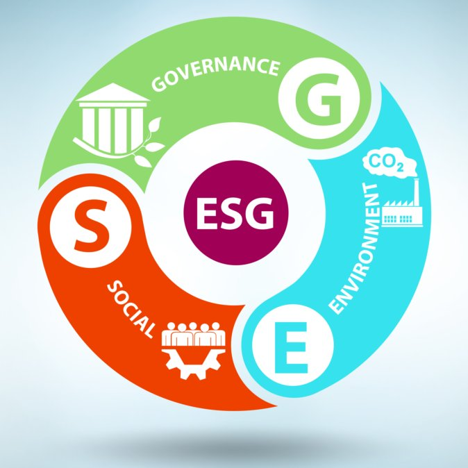

Pfizer is one of the biggest multinational biopharmaceutical companies and medicine suppliers with a robust research capacity (MarketLine, 2021). Its revenue dramatically increased to over 24 billion U.S dollars with the Covid-19 vaccine in the Third Quarter of 2021(Statista, 2021). 

Environmental, social and governance (ESG) score in today’s markets evaluates the sustainable effort of companies, representing the deduction of footprint and organising eco-friendly activities, maintaining the relationship with humans, and testing the transparency of management structure. 

# Table of Contents
1. [Chapter 1 - Project Overview](#ch1)
1. [Chapter 2 - EDA and linear regression](#ch2)
1. [Chapter 3 - Step 1: Data Gathering](#ch3)
1. [Chapter 4 - Step 2: Head and describe](#ch4)
1. [Chapter 5 - Step 3: Target distribution](#ch5)
1. [Chapter 6 - Step 4: Feature distribution](#ch6)

1. [References](#ch90)

# Project Overview

## Data Cleansing
- Use SIC Code (2834 & 2836) to filter biopharmaceutical companies
- Choose needed variables
- Adjust names of variables
- Remove the observations with missing values
- Sort out dataframe with Ticker and Year

## Descriptive Analysis
- Count the number of companies
- Depict the locations of Pharmaceuticals in the world
- Find companies in Ireland
- Check the location of Pfizer 
- Compare total assets, employees, return on assets and Tobin's Q Ratio among Pharmaceuticals
- Describe the developing trend of Pfizer (assets, employees and so on)

## Predictive Analysis
- Lag ESG scores as the delayed impact 
- Delete outliers
- Log total assets
- Regression 
- Residual plot 
- Histogram plot
- Test multicollinearity

