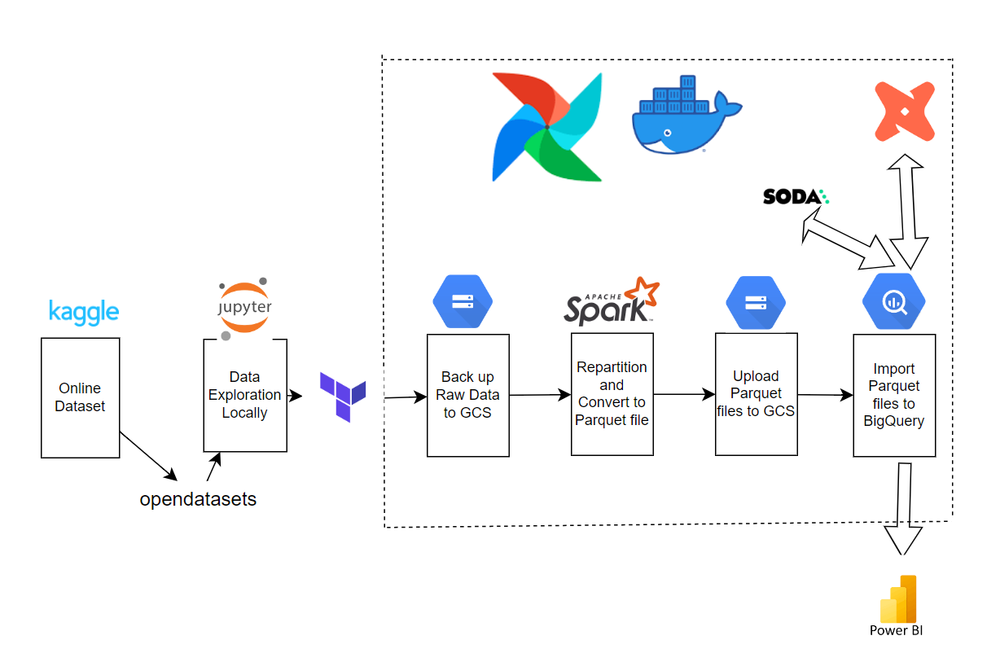
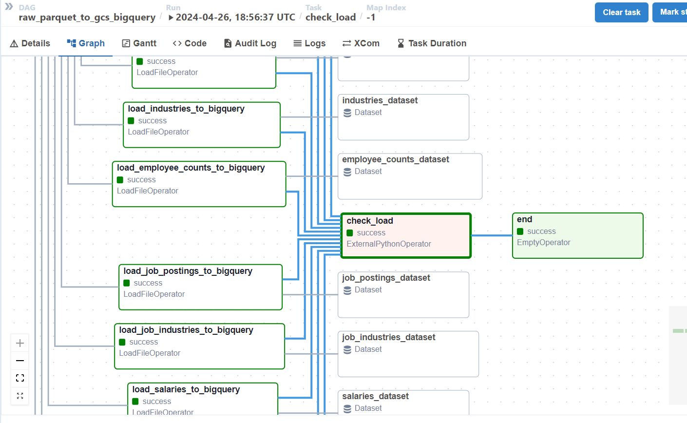
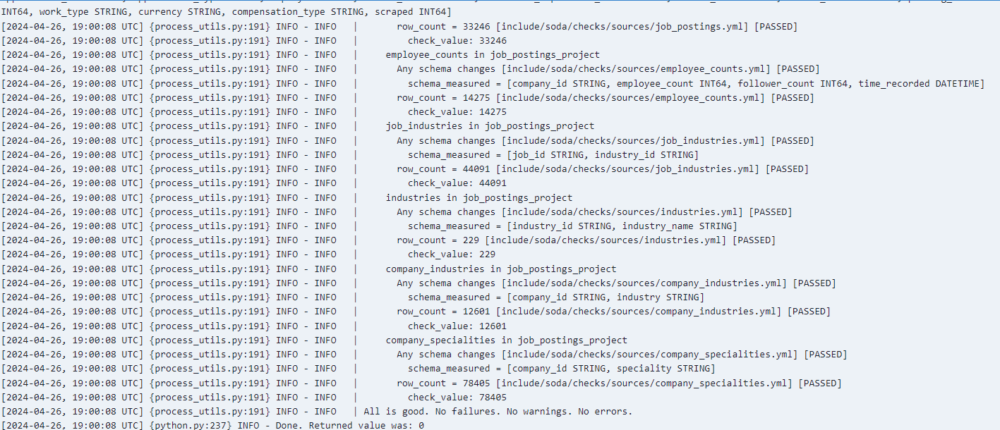
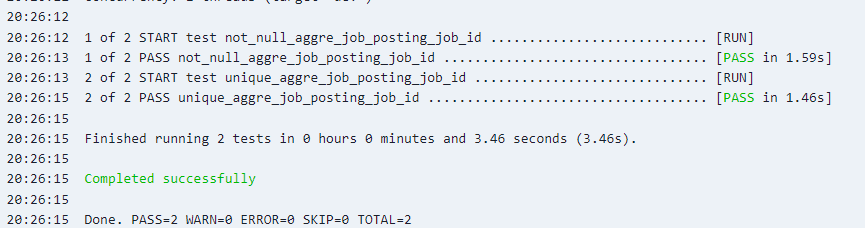
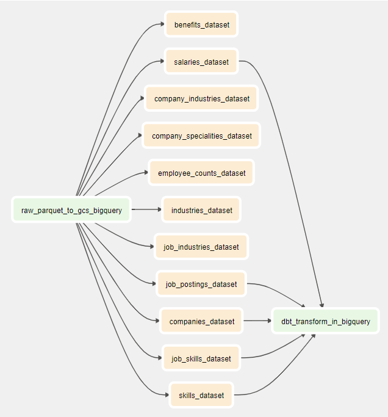
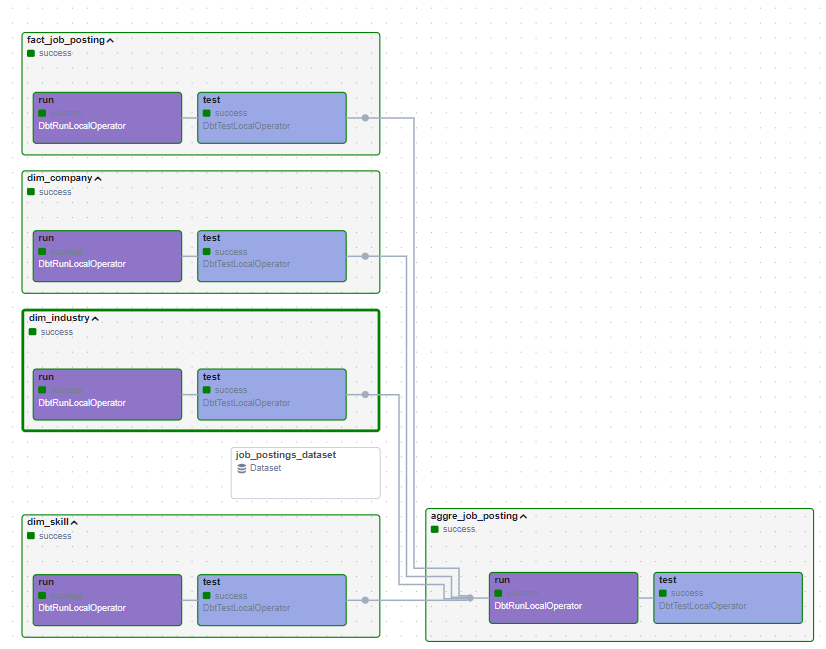

# Job Posting on Linkedin DataSet Pipeline

# Table of Contents
1. [Chapter 1 - Project Overview](#ch1)
2. [Chapter 2 - Data Extraction](#ch2)
3. [Chapter 3 - Terraform manages bucket](#ch3)
4. [Chapter 4 - Data Preparation with Airflow](#ch4)
5. [Chapter 5 - Data Quality Check](#ch5)
6. [Chapter 6 - Data Transformation with dbt](#ch6)
7. [Chapter 7 - Data Visualisation](#ch7)
8. [Chapter 8 - Future Work](#ch8)

# Chapter 1 Project Overview

The project is inspired by my interest: I would like to understand the job market, the whole process includes 

Data Source: [LinkedIn Job Postings - 2023](https://www.kaggle.com/datasets/arshkon/linkedin-job-postings/data)

>This dataset contains a nearly comprehensive record of 33,000+ job postings listed over the course of 2 days, months apart. Each individual posting contains 27 valuable attributes, including the title, job description, salary, location, application URL, and work-types (remote, contract, etc), in addition to separate files containing the benefits, skills, and industries associated with each posting.

The workflow is:

 0. Download csv data from Kaggle public dataset with opendatasets and Prepare dataset summary table for review (size, number of records)
 1. **Terraform** creates bucket with subfolders and dataset in BigQuery
 2. Upload raw data to Google Cloud Storage with **Airflow**
 3. Define schema and repartition to parquet file with **PySpark** and **Airflow**
 4. Upload parquet data to Google Cloud Storage with **Airflow**
 5. Create tables in **BigQuery**
 6. Transform and aggregate data with **dbt**
 7. Visualise data with **PowerBI**

## Infrastructure
Used Techniques are:

**Get data from Kaggle**
 - Data Extraction: Python with [Jupyter notebook](https://jupyter.org/)

**Create Resources on GCP**
 - Infrastructure as Code: [Terraform](https://www.terraform.io/)
 - Data Lake: [Google Cloud Storage](https://cloud.google.com/storage?hl=en)
 - Data Warehouse: [BigQuery](https://cloud.google.com/bigquery/docs/introduction)

**Data Pipeline building**
 - Data Orchestration: [Astro Cli](https://docs.astronomer.io/astro/cli/overview)
 - Data Repartition: [Spark](https://spark.apache.org/)
 - Data Quality Testing before transformation: [Soda](https://docs.soda.io/)
 - Data Transformation: [dbt](https://www.getdbt.com/product/what-is-dbt)
 - Data Quality Testing after transformation: [dbt test](https://docs.getdbt.com/docs/build/data-tests)

 - Containerization: Astro Cli (Docker Compose)

**Data Reporting**
 - Data Visualisation: [Power BI](https://www.microsoft.com/en-us/power-platform/products/power-bi)

The work flow is shown below:

  
  

## Environment Settings in [how_to_run.md](./how_to_run.md)

 # Chapter 2 Data Extraction
 
 With a jupyter notebook named [0_download_explore_data.ipynb](./0_download_explore_data.ipynb), I downloaded the raw data to my Airflow dataset (it is ignored in .gitignore considering space).

 The strucuture is 

  
  

 The size information is 

  
  

 The number of records information is 

  
  

I also use Power BI to draw the relationship among these tables, the data modelling is 

  
  

# Chapter 3 Terraform manages bucket 

Before managing data in the cloud, it is a great practice to use **Terraform** to create bucket, the setting file is [main.tf](./main.tf)

## Google Cloud Storage
The structure of the bucket is 
 - 2024-03-31
   - raw
   - parquet

# Chapter 4 Data Preparation with Airflow

Airflow controls the whole process for data preparation, it includes:
1. Backup **raw** files in **Google Cloud Storage** with [GCSHook](https://airflow.apache.org/docs/apache-airflow-providers-google/stable/_api/airflow/providers/google/cloud/hooks/gcs/index.html) and [PythonOperator](https://airflow.apache.org/docs/apache-airflow/stable/howto/operator/python.html)
2. Repartition and convert raw to **parquet files** with [SparkSubmitOperator](https://registry.astronomer.io/providers/apache-airflow-providers-apache-spark/versions/4.7.1/modules/SparkSubmitHook) and a [python script](./airflow/include/spark_repartition_parquet.py) file
3. Upload **parquet** files to **Google Cloud Storage** with GCSHook and PythonOperator
4. Create an **empty dataset** in **BigQuery** with [BigQueryCreateEmptyDatasetOperator](https://registry.astronomer.io/providers/google/versions/latest/modules/bigquerycreateemptydatasetoperator)
5. Import **parquet data from Google Cloud Storage to BigQuery** with [astro-sdk-python](https://docs.astronomer.io/learn/astro-python-sdk-etl)

The dag file is [in the airflow/dags subfolder](./airflow/dags/data_ingest_gcs.py), the spark script is [in the airflow/include subfolder](./airflow/include/spark_repartition_parquet.py)

The Graph is 

  
  

# Chapter 5 Data Quality Check with Soda and dbt test

Data quality check is a must in the data pipeline, the foucs before transformation and after transformation are different

## Data quality check before transformation

Timepoint: after parquet files were imported into the BiQuery from Google Cloud Storage
Check List:
 - Each table still keeps the same number of records (to avoid data loss or repetition)
 - Each table still keeps the columns that will be used in the transformation and report
 - Each column still keeps the same datatype (especially TIMESTAMP)

Soda can create 1 yaml file corresponding to 1 table in BigQuery, and return the check results in logs

The position of soda check in the pipeline is 

  
  

The result of soda check is  

  
  

## Data quality check after transformation

Timepoint: during dbt transformation, for staging data and report data
Check List:
 - The `job_id`and `company_id` are unique and not null (put industry name and skills in one row if id is duplicated)

 The result of dbt test is   

  
  

# Chapter 6 Data Transformation with dbt

Purposes are:
dim_company model:
  - **employee_count** removes duplicate records for same `company_id` (choose the newest record)
  - join **employee_count** to **company**: add `employee_count` and `follower_count` information

dim_skill model:
  - join **skills_name** to **job_skills**: replace `skill_abr` with full name
  - put multiple skills in one row for one `job_id`

dim_industry model:
  - join **industry** to **job_industry**: replace `industry_id` with full name
  - put multiple industry names in one row for one `job_id`

fact_job_posting model:
 - keep **job_postings** columns that need in the data visualisation
 - remove records in which the `company_id` is NULL

aggre_job_posting_model:
 - put company_info, industry and skills to the fact table **job_postings**

The method is to use [cosmos](https://www.astronomer.io/cosmos/) combine dbt in the airflow, the dags are connected by dataset, once the upstream dag (i.e., load data in the bigquery), the updated dataset triggers this dag.

The dag dependencies is 

  
  

The dataset trigger label is 

  
  

The lineage graph is 

  
  

# Chapter 7 Data Visualisation

Before the data visualisation even before the data engineering project, I want to answer several questions:
1. Which industry has more job openings
2. How about the salary range
3. Which city has more opportunities

Considering the dataset mainly covered the US job market, it is meaningful to find some trends.

The data visualisation can answer my questions well:
1. Healthcare and IT are still popular
2. Around 200K dollars
3. New York is attractive
   

  
  

# Chapter 8 Future Work

1. CI/CD
2. make file

