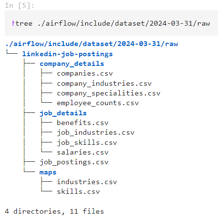
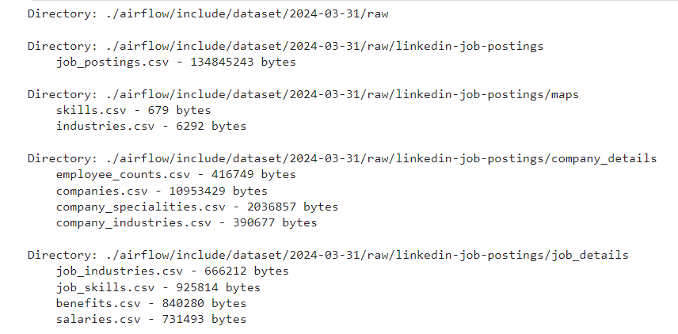
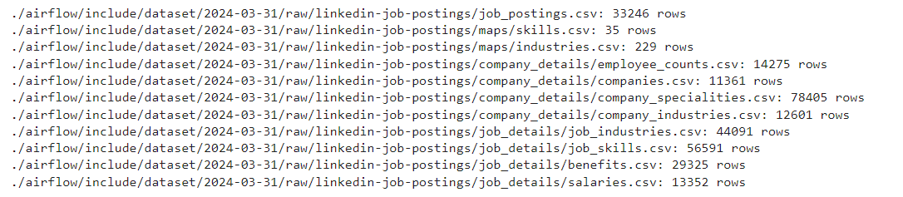

# Job Posting on Linkedin DataSet Pipeline

# Table of Contents

## Chapter 1 Project Overview

The project is inspired by my interest: I would like to understand the job market, the whole process includes 
 0. Download csv data from Kaggle public dataset with opendatasets and Prepare dataset summary table for review (size, number of records)
 1. Upload raw data to Google Cloud Storage with **Airflow**
 2. Define schema and repartition to parquet file with **PySpark** and **Airflow**
 3. Upload parquet data to Google Cloud Storage with **Airflow**
 4. Create tables in **BigQuery**
 5. Transform and aggregate data with **dbt**
 6. Visualise data with **PowerBI**

#### Infrastructure
Used Techniques are:
 - Data Extraction: Python with Jupyter notebook
 - Data Transformation: dbt
 - Data Loading: Airflow (Astro Cli)
 - Data Visualisation: Power BI

 - Data Lake: Google Cloud Storage
 - Data Warehouse: BigQuery

 - Containerization: Astro Cli
 - Data Orchestration: Airflow

 ## Chapter 2 Data Extraction
 
 With a jupyter notebook named [0_download_explore_data.ipynb](./0_download_explore_data.ipynb), I downloaded the raw data to my Airflow dataset (it is ignored in .gitignore considering space).

 The strucuture is 

  
  

 The size information is 

  
  

 The number of records information is 

  
  

