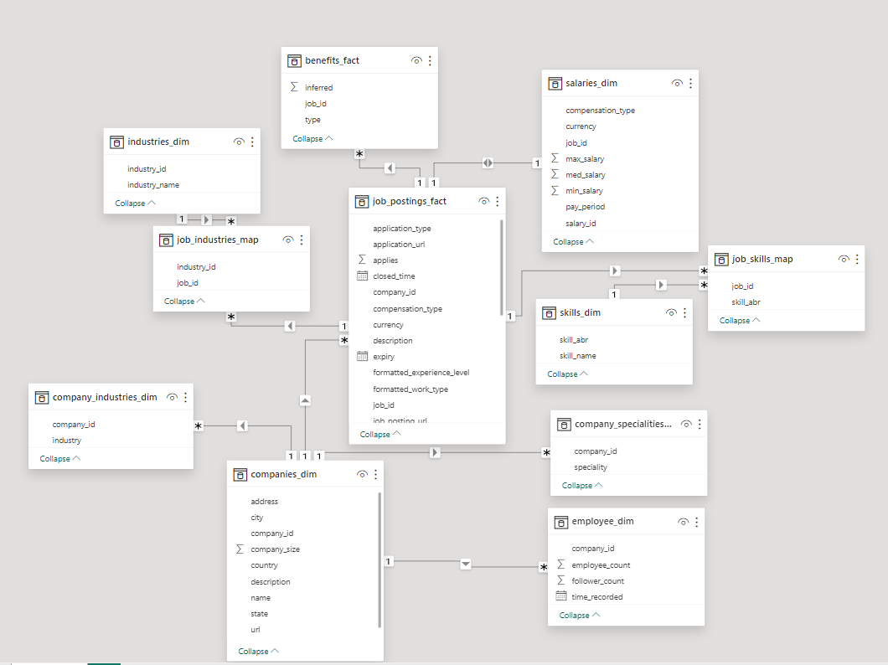
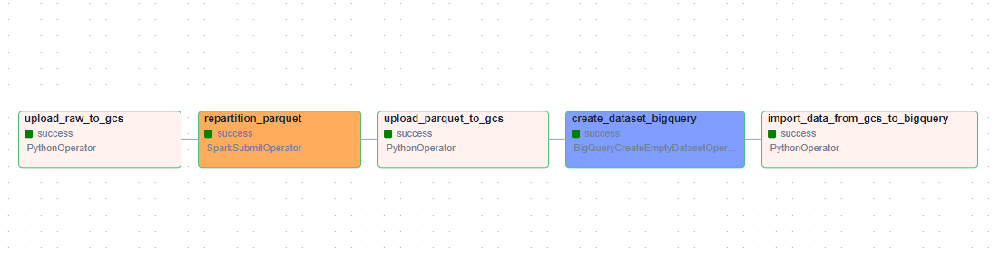

# Job Posting on Linkedin DataSet Pipeline

# Table of Contents

## Chapter 1 Project Overview

The project is inspired by my interest: I would like to understand the job market, the whole process includes 
 0. Download csv data from Kaggle public dataset with opendatasets and Prepare dataset summary table for review (size, number of records)
 1. Upload raw data to Google Cloud Storage with **Airflow**
 2. Define schema and repartition to parquet file with **PySpark** and **Airflow**
 3. Upload parquet data to Google Cloud Storage with **Airflow**
 4. Create tables in **BigQuery**
 5. Transform and aggregate data with **dbt**
 6. Visualise data with **PowerBI**

#### Infrastructure
Used Techniques are:
 - Data Extraction: Python with [Jupyter notebook](https://jupyter.org/)
 - Data Transformation: [dbt](https://www.getdbt.com/product/what-is-dbt)
 - Data Loading: Airflow ([Astro Cli](https://docs.astronomer.io/astro/cli/overview))
 - Data Visualisation: [Power BI](https://www.microsoft.com/en-us/power-platform/products/power-bi)
 - Data Quality Testing: [Soda](https://www.soda.io/?utm_term=soda%20data%20quality&utm_campaign=&utm_source=adwords&utm_medium=ppc&hsa_acc=9734402249&hsa_cam=19663086904&hsa_grp=151658181571&hsa_ad=659050502295&hsa_src=g&hsa_tgt=kwd-793572416606&hsa_kw=soda%20data%20quality&hsa_mt=e&hsa_net=adwords&hsa_ver=3&gad_source=1&gclid=CjwKCAjwtqmwBhBVEiwAL-WAYdyrcpcGT1nQalZtOU7g9myUQfOzV84V_oNOLQbUgTHvgCLxo_U_qBoCu5gQAvD_BwE)

 - Data Lake: [Google Cloud Storage](https://cloud.google.com/storage?hl=en)
 - Data Warehouse: [BigQuery](https://cloud.google.com/bigquery/docs/introduction)

 - Containerization: Astro Cli (Docker Compose)
 - Data Orchestration: [Airflow](https://airflow.apache.org/)

 ## Chapter 2 Data Extraction
 
 With a jupyter notebook named [0_download_explore_data.ipynb](./0_download_explore_data.ipynb), I downloaded the raw data to my Airflow dataset (it is ignored in .gitignore considering space).

 The strucuture is 

  
  

 The size information is 

  
  

 The number of records information is 

  
  

I also use Power BI to draw the relationship among these tables, the data modelling is 

  
  

# Chapter 3 Data Preparation with Airflow
Airflow controls the whole process for data preparation, it includes:
1. Backup **raw** files in **Google Cloud Storage** with [GCSHook](https://airflow.apache.org/docs/apache-airflow-providers-google/stable/_api/airflow/providers/google/cloud/hooks/gcs/index.html) and [PythonOperator](https://airflow.apache.org/docs/apache-airflow/stable/howto/operator/python.html)
2. Repartition and convert raw to **parquet files** with [SparkSubmitOperator](https://registry.astronomer.io/providers/apache-airflow-providers-apache-spark/versions/4.7.1/modules/SparkSubmitHook) and a [python script](./airflow/include/spark_repartition_parquet.py) file
3. Upload **parquet** files to **Google Cloud Storage** with GCSHook and PythonOperator
4. Create an **empty dataset** in **BigQuery** with [BigQueryCreateEmptyDatasetOperator](https://registry.astronomer.io/providers/google/versions/latest/modules/bigquerycreateemptydatasetoperator)
5. Import **parquet data from Google Cloud Storage to BigQuery** with [astro-sdk-python](https://docs.astronomer.io/learn/astro-python-sdk-etl)

The dag file is [in the airflow/dags subfolder](./airflow/dags/data_ingest_gcs.py), the spark script is [in the airflow/include subfolder](./airflow/include/spark_repartition_parquet.py)

The Graph is 

  
  

# Chapter 4 Data Quality Check

Use `soda-core-bigquery` package in Airflow, the configuration file is [here](./airflow/include/soda/checks/configuration.yml) to build a connection with BigQuery by Google Cloud Service Account Credentials and Soda Cloud API.

Add `yml` file corresponding to each table in `soda/checks/sources` folder to execute the check

